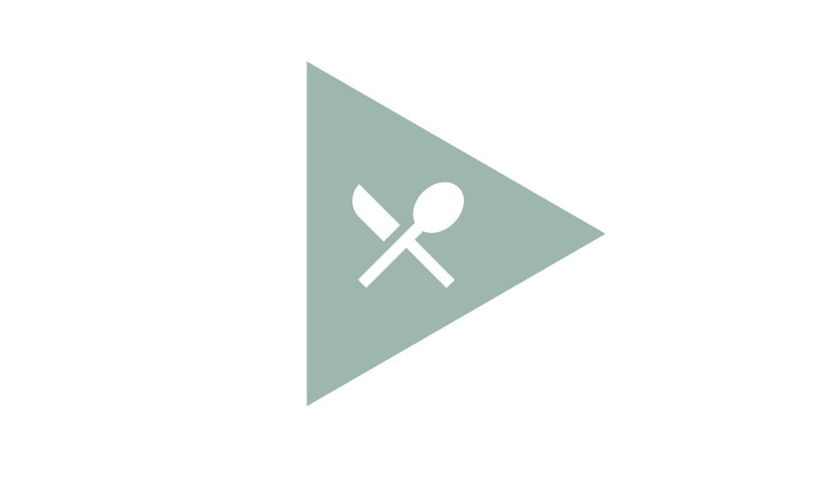
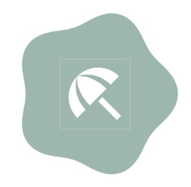
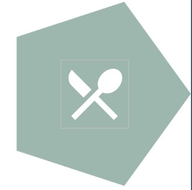
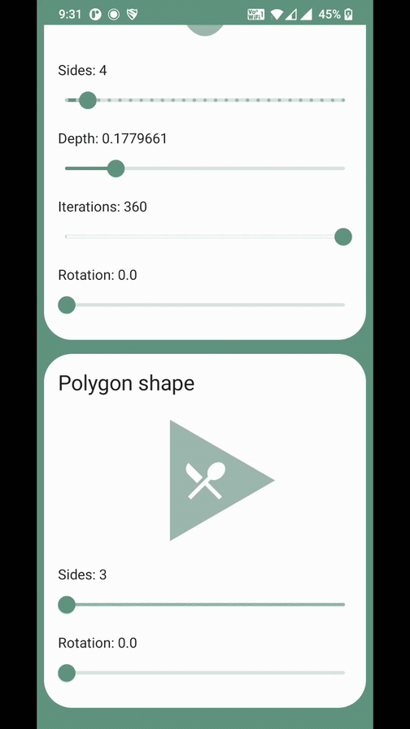

<h2 title="title">Rounded star shape and polygon shape  for Jetpack Compose
</h2>

<p align="center">
  
  
</p>
 
<br>
<br>

## How to install

copy `compose-polygonshape` to your project directory.


include  `compose-polygonshape` in the `settings.gradle`

```groovy
Include ':compose-polygonshape'
```

Add as dependency in `app/build.gradle`
```groovy
dependencies {

    ...
    implementation project(path: ':compose-polygonshape')

}
```


## Usage

### RoundedStarShape()

``` kotlin
val roundedStarShape = RoundedStarShape(
    sides = 7,
    curve = 0.09,
    rotationDegree = 0f,
    iterations = 360
)

Surface(
    shape = roundedStarShape,
) {
    Box(
        modifier = Modifier
            .background(color = Color(0x70205C47))
            .size(160.dp),
        contentAlignment = Center
    ) {
        Image(
            painter = painterResource(id = R.drawable.ic_icon),
            contentDescription = "",
            modifier = Modifier.size(56.dp)
        )
    }
}
```
#### Output



<br>
<br>

### All adjustments


<br><br>


### PolygonShape()

``` kotlin
val polygonShape = PolygonShape(sides = 5, rotationDegree = 0f)

Surface(
    shape = polygonShape,

) {
    Box(
        modifier = Modifier
            .background(color = Color(0x70205C47))
            .size(160.dp),
        contentAlignment = Center
    ) {
        Image(
            painter = painterResource(id = R.drawable.ic_icon_2),
            contentDescription = "",
            modifier = Modifier.size(56.dp)
        )
    }
}
```
#### Output



<br>
<br>

### All adjustments


<br>
<br>

## License

Distributed under the MIT License. See `LICENSE` for more information.